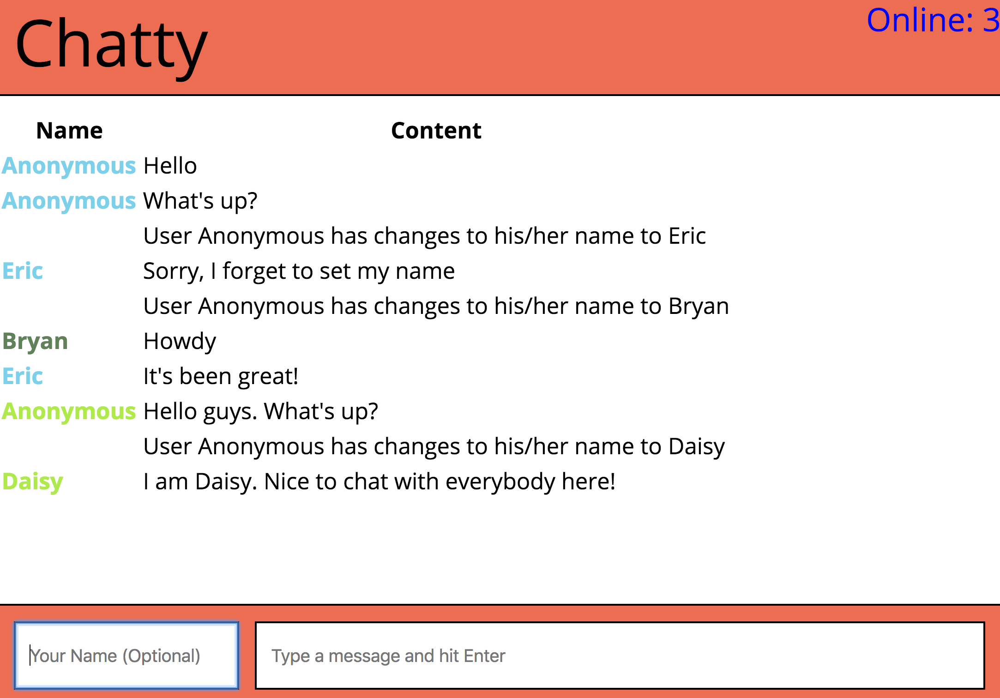

# Chatty-App Project

The Chatty App is a minimal and light dev environment for ReactJS. It allows users to communicate with each other without a registered account. It is built based on the React, as well as Webpack and Babel.

### Final Product



- When any connected user sends a chat message, all connected users receive and display the message
- When any connected user changes their name, all connected users are notified of the name change
- When a user visits or leaves the chatty interface, the header will update the number of online users
- Notifications are styled differently from chat messages
- Different users' names will each be coloured differently, and the color stays then same even if they change theirm name.

### Usage

Clone the boilerplate and create your own git repo.

Install the dependencies and start the server.

```

npm install
npm start
open http://localhost:3000

```

### Static Files

You can store static files like images, fonts, etc in the `build` folder.

### Dependencies

- React
- React-dom
- Webpack
- [webpack-dev-server](https://github.com/webpack/webpack-dev-server)
- [babel-loader](https://github.com/babel/babel-loader)
- Babel-preset-es2015
- Babel-preset-react
- Bbabel-preset-stage-0
- Css-loader
- Eslint
- Eslint-plugin-react
- Node-sass
- Sass-loader
- Sockjs-client
- Style-loader
